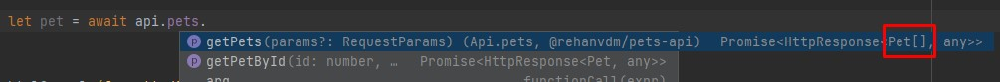
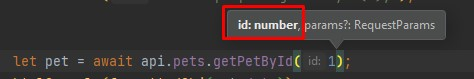
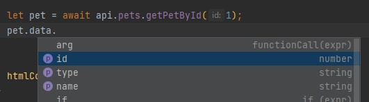
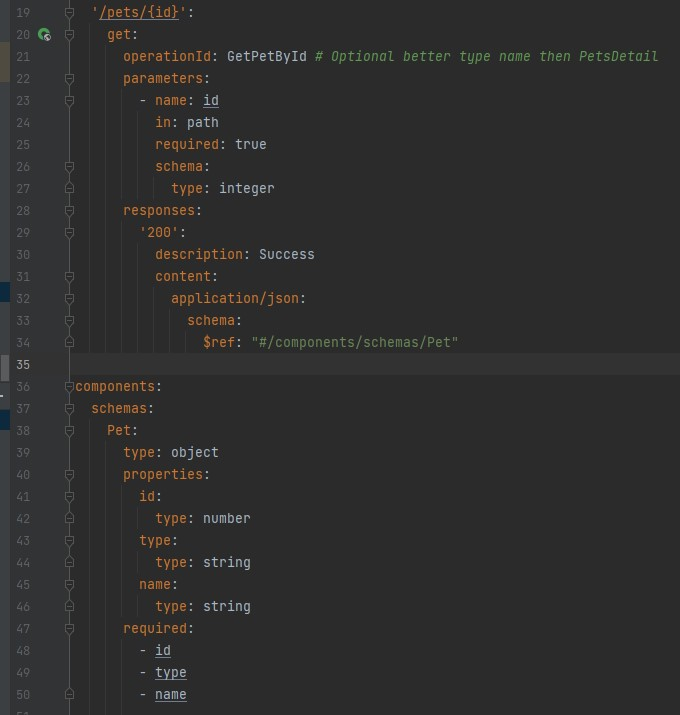
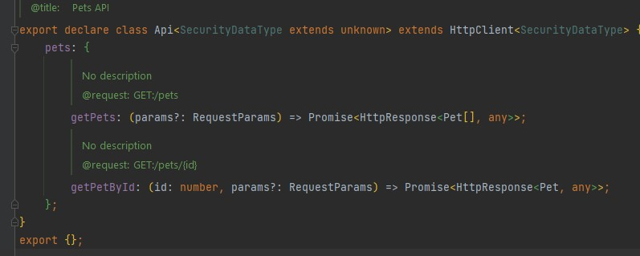
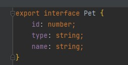

# Frontend 

This project is used to demo the usage of the SDK API NPM packaged that is published by the backend project here: 
[https://github.com/rehanvdm/pets-backend](https://github.com/rehanvdm/pets-backend).

> You can use the GULP plugin for your IDE to debug and run the `gulpfile.js` that is used as the build script. 
You can also run the scripts via`npm run <TASK>`  for your convenience.

Important note about versioning. The NPM package version is the same as the OpenAPI spec version. To prevent breaking
changes, the version number of the API has to be fixed when installing the package.

## Installing

1. Create a [Personal Access Token(PAT) on GitHub](https://docs.github.com/en/authentication/keeping-your-account-and-data-secure/creating-a-personal-access-token#creating-a-token)
   so that we can get the SDK API NPM package. You need to assign the flowing permissions:
   - `read:packages` Download packages from GitHub Package Registry
2. Make a copy of the `.npmrc.example` file and replace:
   -`<YOUR PERSONAL ACCESS TOKEN HERE>` with your GitHub Personal Access Token (PAT) that you obtained above
   - `<YOUR GITHUB PROFILE OR ORGANIZATION NAME>` with your GutHub username of where the package is installed
3. Now you can install packages `npm install`

## Configuring

1. Set the backend URL in the `/src/index.ts` file on line 3, replace `<YOUR URL HERE - NO TRAILING SLASH>` with the URL 
you got after deploying the backend project.

2. Replace the AWS config values if you want to do deploy to AWS in the `gulpfile.js` on lines 25-27:
  - `<YOUR AWS PROFILE NAME TO USE FOR DEPLOYMENTS>`
  - `<AWS REGION TO DEPLOY IN>`
  - `<AWS ACCOUNT ID TO DEPLOY IN>`

## Running locally

The `/src` directory contains a basic HTML file that is used to output the JSON contents of the API calls. The `src/index.ts`
file uses the API SDK, it is transpiled to JS and then copied along with the `src/index.html` file to the `/dist` directory. 

Useful commands: 

- `npm run build_source` - Does the TS => JS transpolation and then copies the `src` files to the `dist` folder.
- `npm run watch_source` - Watches the `src/index.ts` and `src/index.html` files and if they change, it runs the build 
   command above.

## Running on AWS

This is just a basic/default S3 bucket + CloudFront setup, the CloudFront URL will be shown after you deployed. 

- `npm run cdk_diff` - Runs `build_source` and the `cdk diff` command.
- `npm run cdk_deploy` - Runs `build_source` and the `cdk deploy` command.
- `npm run cdk_hotswap` - Runs `build_source` and the `cdk deploy --hotswap` command.

## Using the API SDK package

Example:
```typescript
import {Api} from "@rehanvdm/pets-api"

const apiBaseUrl = "<YOUR URL HERE - NO TRAILING SLASH>";
const api = new Api({
   baseUrl: apiBaseUrl,
   // baseApiParams: {
   //   headers: {
   //     "Authorization": "<YOUR TOKEN HERE>"
   //   }
   // }
});

let pet = await api.pets.getPetById(1);
console.log(pet);
 ```

Note that you get autocomplete for the function (aka API arguments, with proper types) right in your IDE.





The raw OpenAPI spec file can be seen at `node_modules/@rehanvdm/pets-api/schema.yaml`. The `api.pets.getPetById` 
method corresponds to the `GET /pets/{id}` API call. 




